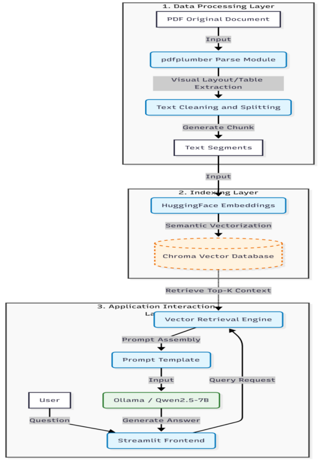
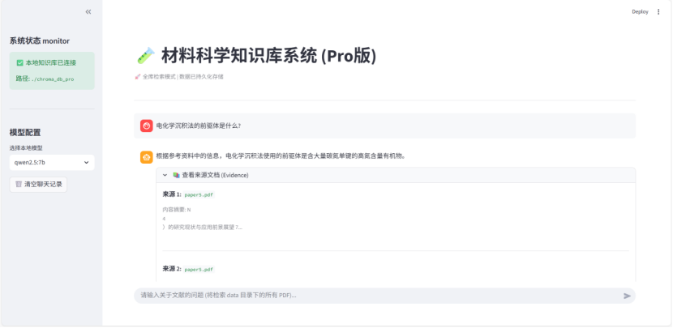

# 🧪 Material-RAG: Visual-Layout Aware QA System

## 📖 Introduction (项目介绍)
**Material-RAG** is a lightweight, localized Retrieval-Augmented Generation (RAG) system designed specifically for **unstructured materials science literature**.

Unlike traditional RAG systems that fail to parse complex PDF tables, this project introduces a **Visual Layout Parsing Strategy** to preserve 2D spatial structures (headers, cross-row tables) during text extraction.

## ✨ Key Features (核心功能)
* **👁️ Visual Layout Parsing**: Utilizes coordinate-based parsing (`pdfplumber`) to reconstruct complex tables, solving the "misalignment" issue in standard PDF loaders.
* **🔒 Privacy-First & Local**: Fully offline inference using **Ollama + Qwen2.5-7B** and **ChromaDB**, ensuring zero data leakage for lab environments.
* **🧠 Structured Prompting**: Specialized prompt engineering to guide the LLM in understanding spatial text alignment.

## 🏗️ Architecture (系统架构)

1.  **Parsing Layer**: Extracts text with visual layout preservation.
2.  **Indexing Layer**: Chunks text with dynamic sliding windows and stores embeddings in Chroma.
3.  **Application Layer**: Retrieves Top-K contexts and generates answers via Qwen2.5.

## 📊 Demo (运行效果)

## 🚀 Usage (如何运行)
1. **Build Database**:
   `python build_db_v2.py`
2. **Run Web UI**:
   `streamlit run app.py`

## 📄 License
MIT License
